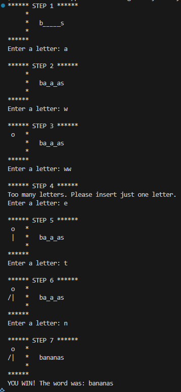

<h1 align="center">👾 HangMan Game<h1>
<h1 align="center">Python</h1>

<h2>Tool used:</h2>
<ul>
   <li>Python Language</li>
   <li>Visual Studio Code IDE</li>
   <li>random libraries</li>
</ul>

<h2>ℹ️ Flowchart</h2>

<h2>✅ Output App Game</h2>
<h4> File: main.py</h4>

<h2>✅ Output Console Game</h2>
<h4> File: main.py</h4>

