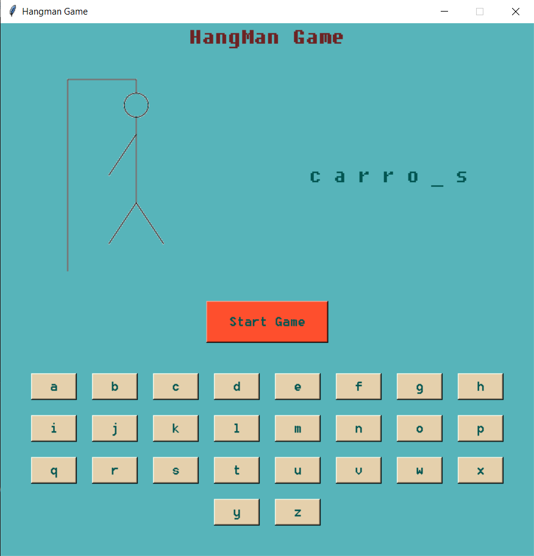
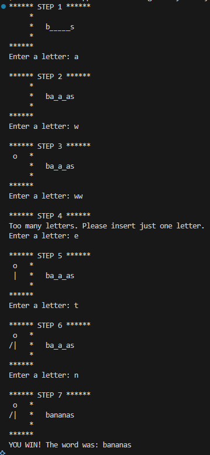

<h1 align="center">👾 HangMan Game<h1>
<h1 align="center">Python</h1>

<h2>Tool used:</h2>
<ul>
   <li>Python Language</li>
   <li>Visual Studio Code IDE</li>
   <li>random libraries</li>
</ul>

<h2>ℹ️ Flowchart</h2>

<h2>✅ Output App Game</h2>
<h3> File: main.py</h3>

This project implements a Hangman game using Python's tkinter library for the graphical user interface (GUI). Below is a short description of the features and functionalities used in the code:

<h3>🎮 Game Overview</h3>

This is a simple Hangman game where the player must guess a hidden word (from a list of fruits) by selecting letters from the alphabet. The game provides visual feedback via hangman images that update with each incorrect guess.

<h3>🔧 Key Features & Components</h3>
<ul>
    <li>
<strong>GUI with tkinter: </strong>The entire interface is built using tkinter, with elements such as labels, buttons, and frames used to organize and display the game.
</li>
    <li>
<strong>Dynamic Word Selection: </strong>A random word is selected from a list when the game starts. The word is displayed with the first and last letters revealed and underscores in place of the other letters.
</li>
    <li>
<strong>Letter Buttons: </strong>The alphabet is displayed using clickable buttons. When a player clicks a letter:

      <ul>
        <li>If correct, the letter is revealed in the word.</li>
        <li>If incorrect, the hangman image changes and an error counter increases.</li>
      </ul></li>
    <li>
<strong>Image Handling: </strong>A set of 7 images (hang0.png to hang6.png) are used to visually represent the hangman progression based on the number of wrong guesses.
</li>
    <li>
<strong>Game Feedback: </strong>
      <ul>
        <li>If the user wins or loses, a popup message (messagebox.showwarning) is shown.</li>
        <li>The background flashes red on incorrect or repeated guesses as visual feedback.</li>
      </ul>
</li>
    <li>
<strong>Start Button: </strong>The game begins only when the "Start Game" button is clicked. This initializes the game state and displays the first image.
</li>
    <li>
<strong>Custom Design & Layout: </strong>The window is styled with custom colors, fonts (Fixedsys), and layout arrangements using Frame, Label, and Button widgets.
</li>
</ul>

This project demonstrates basic usage of Python GUI programming, event handling, conditional logic, string manipulation, and visual user interaction.

<h2>✅ Output Console Game</h2>
<h3> File: main.py</h3>

